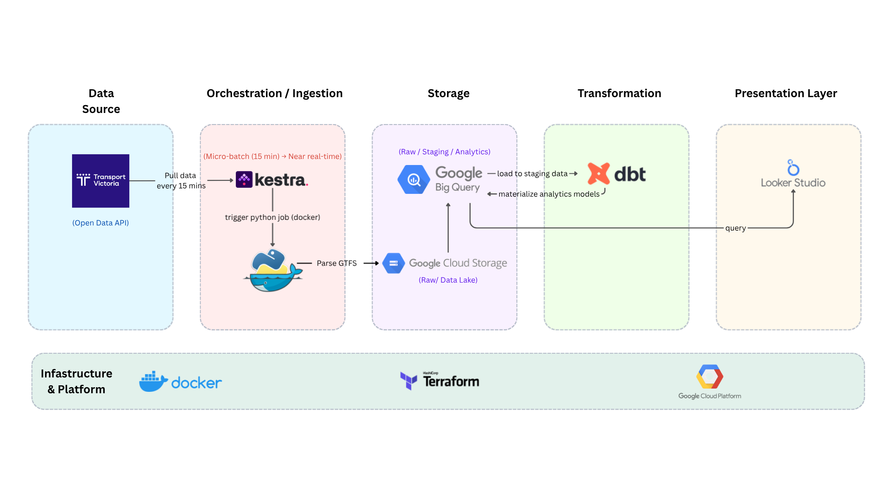

## Problem Statement

This project builds an end-to-end data pipeline using **GTFS Realtime (Metro Trains, Victoria)** to analyze public transport disruptions.

Public transport disruptions (e.g. maintenance, incidents, events) are difficult to analyze over time. This pipeline enables:

- Tracking the frequency of service disruptions  
- Understanding the types and impact of incidents  
- Analyzing how disruptions vary across different times of day  

The pipeline uses a **micro-batch approach (every 15 minutes)** to achieve near real-time insights while keeping the architecture simple and cost-effective.

---

## Tech Stack

- Docker – containerized local development  
- Google Cloud Platform (GCP) – cloud services  
- Terraform – infrastructure provisioning  
- Kestra – workflow orchestration (scheduled ingestion every 15 minutes)  
- dbt – data transformation and modeling  
- Google Cloud Storage (GCS) – raw data lake  
- BigQuery – analytical data warehouse  
- Streamlit – dashboard and visualization  

---

## Architecture



---

## Prerequisites

- Python 3.13  
- uv  
- Google Cloud account  
- Google Cloud CLI (gcloud)  
- Terraform  

---

## Setup

### 1. Python environment

```bash
uv sync
```

### 2. API setup

Register for the PTV API and create a .env file:

```bash
PTV_KEYID=<your-api-key>
```

### 3. GCP setup

Create a service account and assign the following roles:

- Storage Object Admin
- BigQuery Data Editor
- BigQuery Job User

Download the service account JSON key and store it in .gc/.

Set credentials:

```bash
export GOOGLE_APPLICATION_CREDENTIALS=<path-to-your-credentials.json>
```

Authenticate:

```bash
gcloud auth activate-service-account --key-file $GOOGLE_APPLICATION_CREDENTIALS
```

### 4. Terraform setup

Initialize Terraform:

```bash
terraform init
```

Preview changes:

```bash
terraform plan
```

Apply infrastructure:

```bash
terraform apply
```

Verify in GCP
- GCS bucket created (e.g. ptv-bucket-kd)
- BigQuery dataset created (e.g. ptv_metro_dataset)

### 5. Kestra setup
- Build project with docker

```
docker compose up -d
```

- Kestra will now live at ***localhost:8080***
- Load file kestra/ingest_data.yaml to Kestra flow and upload file python script app/ingest_data.py the project's namespace (capstone-project). This will be used to fetch the data from the Transport Victoria API.
- Provide KV variables in the KV store with the newly created details for the project on GCP
    - `GCP_PROJECT_ID`
    - `GCP_LOCATION`
    - `GCP_BUCKET_NAME`
    - `GCP_DATASET`
- Follow [Kestra configure GCP] (https://kestra.io/docs/how-to-guides/google-credentials) for more details and ensure the service account's secret key is encoded 

