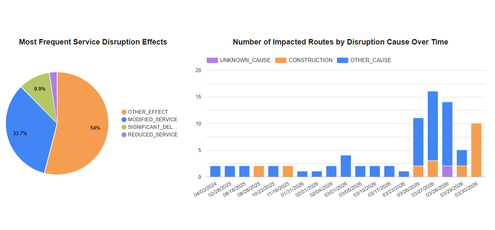

# Transport Victoria Service Updates Data Pipeline

## 1. Problem Description

Commuters and transport analysts in Victoria lack a consolidated, historical view of public transport disruptions. While real-time data is available via the PTV API, there is no built-in historical tracking. This means that public transport disruptions (e.g., maintenance, incidents, events) are difficult to analyze over time. 

This project solves this problem by building an end-to-end data pipeline that continuously ingests GTFS Realtime data (Metro Trains, Victoria), building a data lake and data warehouse, enabling users to:
- Track the historical frequency of service disruptions.
- Understand the types and impact of different incidents.
- Analyze how disruptions vary across different times of day and across different routes.

By using a micro-batch approach (every 15 minutes), the pipeline achieves near real-time insights while keeping the architecture simple and cost-effective.

---

## 2. Tech Stack

- **Cloud**: Google Cloud Platform (GCP)
- **Infrastructure as Code (IaC)**: Terraform
- **Workflow Orchestration**: Kestra
- **Data Lake**: Google Cloud Storage (GCS)
- **Data Warehouse**: Google BigQuery
- **Data Transformation**: dbt (Data Build Tool)
- **Dashboard**: Looker Studio
- **Language**: Python (environment managed by `uv`)

---

## 3. Project Structure

```text
transport-victoria-service-updates/
├── app/                  # Python extraction scripts
│   └── ingest_data.py
├── dbt/                  # dbt data transformations
│   └── ptv_metro_service_updates/
│       ├── models/       # SQL models (staging, intermediate, marts)
│       ├── seeds/        # Static CSV reference data
│       └── dbt_project.yml
├── docker-compose.yaml   # Local Kestra container setup
├── images/               # Documentation images
├── kestra/               # Kestra orchestration configurations
│   └── ingest_data.yml   # The primary pipeline DAG
├── profiles_template.yaml# Template for local dbt development
├── README.md             # This document
├── terraform/            # Infrastructure as Code (GCP resources)
│   ├── main.tf
│   └── variables.tf
└── uv.lock               # Python environment locking
```

---

## 4. Cloud & Infrastructure (IaC)

The project is developed entirely in the cloud using **Google Cloud Platform (GCP)**. 
Infrastructure is provisioned using **Terraform**, which manages the creation of the GCS bucket (Data Lake) and the BigQuery dataset and base tables (Data Warehouse).


---

## 5. Data Ingestion & Workflow Orchestration

The project implements an end-to-end batch/micro-batch pipeline orchestrated via a single DAG in **Kestra**. Orchestration includes multiple integrated steps:
1. **Extraction**: A Python script is executed to fetch the latest GTFS Realtime data from the PTV API.
2. **Data Lake**: The raw JSON data format is uploaded directly to **Google Cloud Storage (GCS)**.
3. **Data Warehouse**: Kestra loads the raw data from GCS directly into **BigQuery**.
4. **Transformation**: Kestra triggers a `dbt build` command inside a Docker container to model the newly loaded data.


---

## 6. Data Warehouse

The Data Warehouse is hosted on **BigQuery**. 
The base tables for raw data are provisioned directly by Terraform and are **partitioned by `entity_timestamp` (DAY)**. 

**Optimization Explanation:** Partitioning the tables by day is optimal for the upstream queries because dashboard filtering and analytical queries almost exclusively filter or aggregate disruption events based on the date they occurred. This heavily reduces the amount of data scanned by Looker Studio and dbt during processing, improving query performance and significantly saving computing costs.

---

## 7. Transformations (dbt)

Data transformations are fully defined using **dbt**. The pipeline does not rely on simple SQL scripts, but leverages a robust data modeling structure:
- **Staging**: Raw nested JSON alerts from BigQuery are unpacked into relational staging views (`stg_service_alerts_base`, etc.).
- **Intermediate**: Business logic is applied to join active periods and entities.
- **Marts**: A final, materialized fact table (`fct_service_update_impacts`) is generated and enriched with proper metadata from seed dimensional tables (stops, routes, agencies) for the dashboard. *Utilizes the `dbt_utils` package (e.g., for generating surrogate keys).*
- **Testing**: Integrates automated data quality checks via `schema.yml` constraints (`not_null`, `unique`) and custom SQL data tests inside the `tests/` directory.

Below is the screenshot from BigQuery showing the transformed data structure:


More details in `dbt/ptv_metro_service_updates/README.md`
---

## 8. Dashboard

The final transformed data in BigQuery is visualized using a **Looker Studio** dashboard containing two main tiles:
1. **Most Frequent Service Disruption Effects**: Highlights the specific types of impacts (e.g., delays, alterations) across different train lines.
2. **Number of Impacted Routes by Disruption Cause Over Time**: Shows the frequency and timeline of incidents to help spot historical trends.

The data powering these visualizations is sourced directly from the final aggregate models located in the `dbt/ptv_metro_service_updates/models/marts/reporting` folder.



[Looker Studio URL](https://lookerstudio.google.com/reporting/b3525a7f-02d2-4673-8b36-7463d9abfc26/page/p_123456789)

---

## 9. Reproducibility: How to Run the Code

These instructions provide a straightforward way to spin up the entire project locally and on the cloud.

### Prerequisites

- Python 3.12 
- `uv` (for Python dependency management)
- Google Cloud account 
- Google Cloud CLI (`gcloud`)
- Terraform
- Docker & Docker Compose

### Step 1: Clone and Setup Python Environment

1. Clone the repository:
   ```bash
   git clone https://github.com/ddvkhanh/transport-victoria-service-updates.git
   cd transport-victoria-service-updates
   ```
2. Sync the environment:
   ```bash
   uv sync
   ```

### Step 2: API Setup

Register for the [PTV API](https://www.ptv.vic.gov.au/footer/data-and-reporting/datasets/ptv-timetable-api/) and create a `.env` file in the root directory:

```env
PTV_KEYID=<your-api-key>
```
*Note: for documentation on creating the account and API key, visit [PTV Help & Support] (https://opendata.transport.vic.gov.au/Help-And-Support)

### Step 3: GCP Setup

1. Create a service account in GCP and assign the following roles:
   - Storage Object Admin
   - BigQuery Data Editor
   - BigQuery Job User
2. Download the service account JSON key and store it in `.gc/credentials.json` (create the directory if needed).
3. Set the credentials environment variable:
   ```bash
   export GOOGLE_APPLICATION_CREDENTIALS="<path-to-your-credentials.json>"
   ```
4. Authenticate your gcloud CLI:
   ```bash
   gcloud auth activate-service-account --key-file $GOOGLE_APPLICATION_CREDENTIALS
   ```

### Step 4: Infrastructure Provisioning (Terraform)

Before provisioning resources, you must provide your specific GCP Project ID and bucket name to Terraform. For simplicity, keep all other naming conventions the same.

1. Navigate to the Terraform directory:
   ```bash
   cd terraform
   ```
2. Open `variables.tf` and adjust the default values to match your setup:
   - `gcs_project`: Replace with your actual GCP Project ID.
   - `gcs_bucket_name`: Ensure this is a globally unique bucket name. The one used in this project is `ptv-bucket-kd` .
   - `gcs_credentials`: Absolute path to your `.gc/credentials.json`.
3. Initialize Terraform:
   ```bash
   terraform init
   ```
4. Preview and apply the infrastructure changes:
   ```bash
   terraform plan
   terraform apply
   ```
5. Verify in GCP that your GCS bucket and BigQuery dataset were created successfully.

### Step 5: Configure dbt Sources

Since you specified your own GCP Project ID in Terraform, you must also tell dbt where to find the raw data.

1. Open `dbt/ptv_metro_service_updates/models/staging/sources.yml`.
2. Find the `raw_data` source and update the fields:
   - `database`: Your GCP Project ID (e.g., `"your-project-id"`).
   - `schema`: Leave as `"ptv_metro_dataset"`.

### Step 6: Kestra Orchestration & BigQuery Connection

Kestra manages both data ingestion and dbt execution. You must ensure the configuration points to your specific GCP resources:

1. Open `kestra/ingest_data.yml` and locate the `dbt_build` task. Update the hardcoded `profiles` section (around line 65) so dbt can connect to your BigQuery data warehouse:
   - `project`: Update this to your GCP Project ID.

2. Start Kestra locally using Docker:
   ```bash
   docker compose up -d
   ```

3. Open your browser and navigate to `http://localhost:8080` and create a new flow, pasting the contents of your revised `kestra/ingest_data.yml`.

4. Create the required **KV Store variables** in Kestra with your project details:
   - `GCP_PROJECT_ID`: Your GCP Project ID
   - `GCP_LOCATION`: `australia-southeast1`
   - `GCP_BUCKET_NAME`: `ptv-bucket-kd` (or your custom bucket name if you changed it)
   - `GCP_DATASET`: `ptv_metro_dataset`

5. Configure the necessary **Secrets** in Kestra (values MUST be **base64 encoded**):
   - `PTV`: Your PTV API Key, base64 encoded. (e.g., `echo -n "your-api-key" | base64`)
   - `GCP_SERVICE_ACCOUNT`: The contents of your GCP `credentials.json` base64 encoded. (Follow [Kestra GCP Instructions](https://kestra.io/docs/how-to-guides/google-credentials) for proper secret manager configuration).

   Add these 2 base64 encoded values to `.env_encoded` file in the source location.
   ```env
   PTV=<base64-encoded-ptv-api-key>
   GCP_SERVICE_ACCOUNT=<base64-encoded-gcp-service-account>
   ```

6. Enable the trigger and your pipeline will run automatically every 15 minutes!

### Step 7: Local dbt Development (Optional)

If you wish to develop and test dbt models locally outside of Kestra:

1. Locate the `profiles_template.yaml` file in the root directory. Copy its contents.

2. Create a `profiles.yml` file in your local `~/.dbt/` folder (create the `.dbt` hidden folder in your user's home directory if it doesn't exist).

3. Paste the template into `~/.dbt/profiles.yml` and adjust the connection details:
   - `keyfile`: Provide the absolute path to your `credentials.json`.
   - `project`: Your GCP Project ID.

4. Ensure the root profile block name in your `~/.dbt/profiles.yml` exactly matches the `profile:` setting defined inside `dbt/ptv_metro_service_updates/dbt_project.yml` (which currently seeks the profile named `ptv_metro_service_updates`).

5. Run `dbt debug` from inside your `dbt/ptv_metro_service_updates` directory to verify your local connection to BigQuery.
