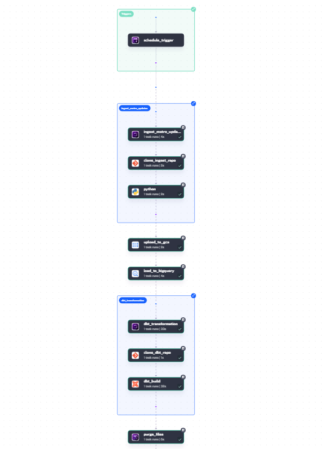
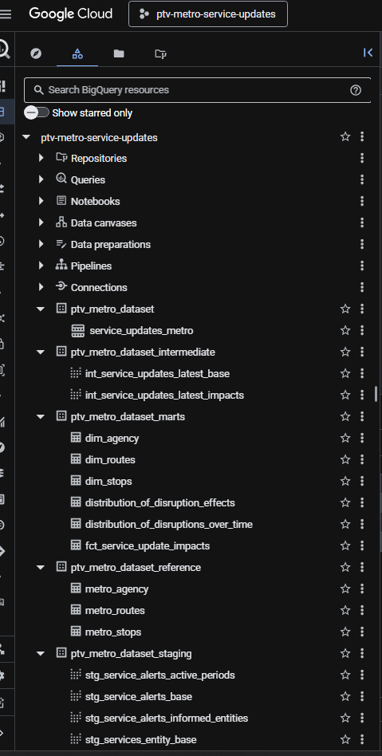
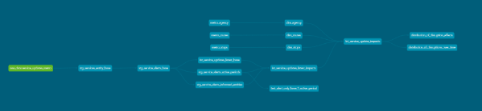
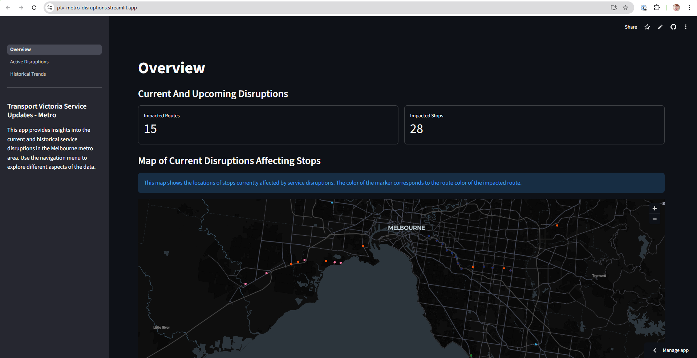
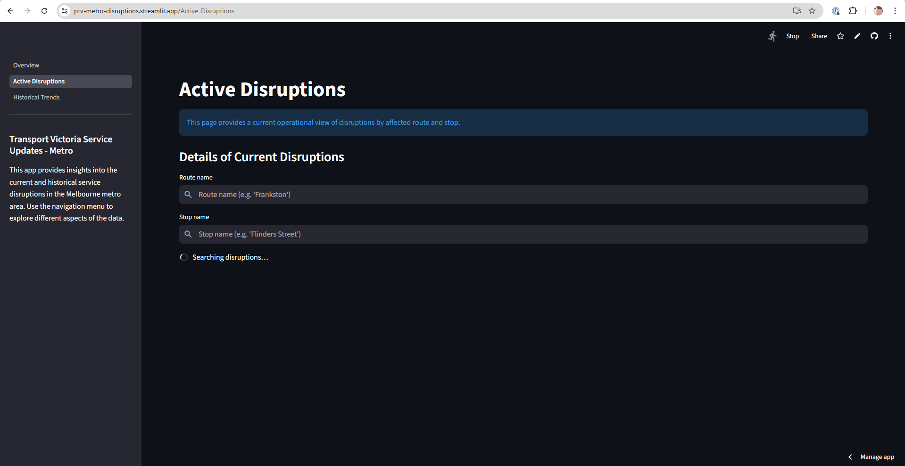
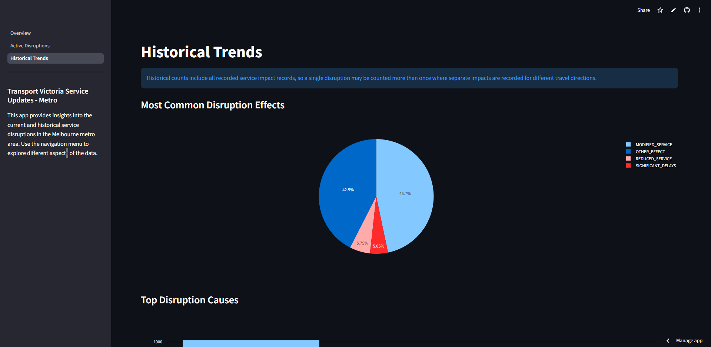
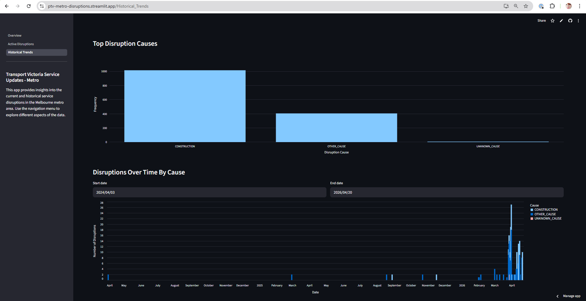
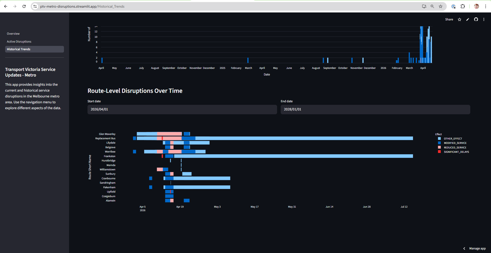

# Transport Victoria (Australia) Service Updates Data Pipeline


*Visualization generated by NotebookLM*

## 1. Problem Description

Commuters and transport analysts in the state of Victoria (Australia) lack a consolidated, historical view of public transport disruptions. While real-time data is available via the PTV API, there is no built-in historical tracking. This means that public transport disruptions (e.g., maintenance, incidents, events) are difficult to analyze over time. 

This project solves this problem by building an end-to-end data pipeline that continuously ingests GTFS Realtime data (Metro Trains, Victoria). It establishes a data lake and data warehouse, enabling users to:
- Track the historical frequency of service disruptions.
- Understand the types and impact of different incidents.
- Analyze how disruptions vary across different times of day and across different routes.

By using a micro-batch approach (every 15 minutes), the pipeline achieves near real-time insights while keeping the architecture simple and cost-effective.

🔗 **Live Dashboard**: [ptv-metro-disruptions.streamlit.app](https://ptv-metro-disruptions.streamlit.app/)

---

## 2. Data Source Overview

The GTFS Realtime Metro Train Service Alerts data feed provides real-time information about planned and unplanned disruptions affecting metropolitan train services. This includes cancellations or unforeseen events affecting a station, route, or the entire network in Melbourne, Victoria. 
*Note: This API endpoint has a rate limit of 24 calls per minute and a caching time of 30 seconds.*

- [API URL](https://opendata.transport.vic.gov.au/dataset/2d9a7228-5b81-40d3-8075-ae7a3da42198/resource/2a90e184-ac14-468a-92ff-9618cb43fb77/download/gtfsr_metro_train_service_alerts.openapi.json)
- [Data Dictionary](https://opendata.transport.vic.gov.au/dataset/gtfs-realtime/resource/2a90e184-ac14-468a-92ff-9618cb43fb77)

This API returns a response in **Protocol Buffer (.pb)** format.

---

## 3. Tech Stack

- **Cloud**: Google Cloud Platform (GCP)
- **Infrastructure as Code (IaC)**: Terraform
- **Workflow Orchestration**: Kestra
- **Data Lake**: Google Cloud Storage (GCS)
- **Data Warehouse**: Google BigQuery
- **Data Transformation**: dbt (Data Build Tool)
- **Dashboard**: Streamlit
- **Language**: Python (environment managed by `uv`)

---

## 4. Project Structure

```text
transport-victoria-service-updates/
├── app/                  # Python extraction scripts
│   └── ingest_data.py
├── dbt/                  # dbt data transformations
│   └── ptv_metro_service_updates/
│       ├── models/       # SQL models (staging, intermediate, marts)
│       ├── seeds/        # Static CSV reference data
│       └── dbt_project.yml
├── docker-compose.yaml   # Local Kestra container setup
├── images/               # Documentation images
├── kestra/               # Kestra orchestration configurations
│   └── ingest_data.yml   # The primary pipeline DAG
├── profiles_template.yaml# Template for local dbt development
├── README.md             # This document
├── streamlit/            # Streamlit dashboard application
│   ├── app.py            # Entry point & multi-page navigation
│   ├── pages/            # Individual dashboard pages
│   │   ├── 1_Overview.py
│   │   ├── 2_Active_Disruptions.py
│   │   └── 3_Historical_Trends.py
│   ├── utils/            # Shared utilities (BigQuery query helper)
│   └── .streamlit/       # Streamlit configuration & secrets
├── terraform/            # Infrastructure as Code (GCP resources)
│   ├── main.tf
│   └── variables.tf
└── uv.lock               # Python environment locking
```

---

## 5. Cloud & Infrastructure (IaC)

The project is developed entirely in the cloud using **Google Cloud Platform (GCP)**. 
Infrastructure is provisioned using **Terraform**, which manages the creation of the GCS bucket (Data Lake) and the BigQuery dataset and base tables (Data Warehouse).


---

## 6. Data Ingestion & Workflow Orchestration

The project implements an end-to-end batch/micro-batch pipeline orchestrated via a single DAG in **Kestra**. Orchestration includes multiple integrated steps:

1. **Extraction**: A Python script is executed to fetch the latest GTFS Realtime data from the PTV API.
2. **Data Lake**: The newly extracted data is uploaded directly to **Google Cloud Storage (GCS)** as a newline-delimited JSON (`.ndjson`) file.
3. **Data Warehouse**: Kestra natively loads this raw `.ndjson` data from GCS directly into a base table in **BigQuery**.
4. **Transformation**: Kestra triggers a `dbt build` command inside a specialized Docker container to immediately process and model the newly loaded data.



*For more details on how each integration works, please refer to [`kestra/README.md`](./kestra/README.md).*

---

## 7. Data Warehouse

The Data Warehouse is hosted entirely on **BigQuery**. The foundation of this warehouse involves raw base tables provisioned directly via Terraform, which are strategically **partitioned by `entity_timestamp` (DAY)**.

To keep data efficiently organized and logically separated, the warehouse utilizes the following schema structure:
- **Raw Layer** (`ptv_metro_dataset`): Contains the raw, un-transformed data directly from GCS (e.g., the `service_updates_metro` table).
- **Staging Layer** (`ptv_metro_staging`): Houses the initial staging models where raw JSON data is unpacked and standardized.
- **Intermediate Layer** (`ptv_metro_intermediate`): Stores intermediate models where business logic and join operations are applied.
- **Marts Layer** (`ptv_metro_marts`): Contains the final, aggregated fact and dimension tables ready for dashboard consumption.

**Optimization Note:** Day-level partitioning on the raw data table is crucial for efficiency. Because dashboard filters and downstream dbt analytical queries overwhelmingly aggregate disruptions based on their occurrence date, partitioning drastically reduces the volume of data scanned. This significantly improves query execution speeds and minimizes compute costs.

**GCS Lifecycle Policy:** To prevent the data lake from accumulating stale files and incurring unnecessary storage costs, the GCS bucket enforces the following lifecycle rules:
- **Delete objects** older than **3 days** since creation — raw `.ndjson` files are safely removed once loaded into BigQuery.
- **Delete incomplete multipart uploads** older than **1 day** since upload was initiated — avoids orphaned upload fragments consuming storage.



---

## 8. Transformations (dbt)

Data transformations are fully managed and defined using **dbt**. Instead of relying on manual SQL scripts, the pipeline leverages dbt's modular, layered data modeling architecture to ensure clean, tested, and reliable datasets:

- **Staging**: The raw, nested JSON alerts ingested into BigQuery are unpacked, flattened, and cast into standardized relational views (e.g., `stg_service_alerts_base`).
- **Intermediate**: Complex business logic is applied here to cleanly join active alert periods with the specific entities (routes/stops) they affect.
- **Marts**: The final layer produces materialized, aggregated fact and dimension tables optimized exclusively for reporting. This layer is heavily enriched with contextual metadata by joining dimensional seed data (stops, routes, agencies). *Note: The `dbt_utils` package is utilized here for generating surrogate keys.*
- **Testing**: Automated data quality checks are built-in. Standard constraints (`not_null`, `unique`) are enforced via `schema.yml`, while custom SQL validation logic is maintained inside the `tests/` directory to safeguard dashboard integrity.

### Marts Models

The marts layer is split into a core fact table and a set of reporting-focused views:

| Model | Type | Description |
|---|---|---|
| `fct_service_update_impacts` | Fact table | Central grain table joining service alerts with route, stop, and agency dimensions. One row per alert–entity impact. |
| `dim_routes` | Dimension | Route reference data (route ID, short/long name, type, color). |
| `dim_stops` | Dimension | Stop reference data (stop ID, name, lat/lon). |
| `dim_agency` | Dimension | Agency reference data (agency ID and name). |
| **Reporting** | | |
| `current_route_stop_impacts` | Reporting | Currently active disruptions filtered by timestamp, deduplicated per route–stop combination, partitioned by `active_period_start` and clustered by `route_id`, `stop_id`. Feeds the Overview and Active Disruptions pages. |
| `historical_route_disruptions` | Reporting | Historical route-level disruptions, deduplicated per entity–route, partitioned by `active_period_start` and clustered by `route_id`. Feeds the Gantt timeline chart. |
| `historical_disruptions_by_cause` (aliased `distribution_of_disruptions_over_time`) | Reporting | Daily disruption counts grouped by cause, partitioned by `disruption_date` and clustered by `cause`. Feeds the time-series bar chart. |
| `disruption_effects_summary` (aliased `distribution_of_disruption_effects`) | Reporting | Aggregate frequency of each disruption effect across all historical records. Feeds the pie chart. |
| `disruption_causes_summary` (aliased `distribution_of_disruption_causes`) | Reporting | Aggregate frequency of each disruption cause across all historical records. Feeds the bar chart. |
| `top_impacted_routes` | Reporting | Top routes ranked by distinct alert count. Reserved for future dashboard tiles. |

Below is a visualization excerpt of the dbt pipeline lineage:



*For comprehensive documentation of individual models and schema structures, please explore the dedicated [`dbt/README.md`](./dbt/ptv_metro_service_updates/README.md).*

---

## 9. Dashboard (Streamlit)

The final transformed data in BigQuery is visualized through a multi-page **Streamlit** application that connects directly to BigQuery at runtime.

🔗 **Live App**: [ptv-metro-disruptions.streamlit.app](https://ptv-metro-disruptions.streamlit.app/)

The app is structured into three pages:

### Page 1 — Overview
Provides a high-level snapshot of the current network state:
- **Impacted Routes** and **Impacted Stops** summary metrics.
- **Interactive map** of stops currently affected by service disruptions, with marker colours matching each route's official line colour (sourced from `current_route_stop_impacts`).



### Page 2 — Active Disruptions
Provides an operational view of live disruptions:
- Searchable table filterable by **route name** and **stop name**.
- Displays cause, effect, description, and active period for each disruption (sourced from `current_route_stop_impacts`).



### Page 3 — Historical Trends
Provides analytical charts for understanding disruption patterns over time:
- **Most Common Disruption Effects** — Pie chart of effect frequency (sourced from `disruption_effects_summary`).
- **Top Disruption Causes** — Bar chart of cause frequency (sourced from `disruption_causes_summary`).
- **Disruptions Over Time by Cause** — Date-filtered stacked bar chart, visualizing daily disruption counts grouped by cause (sourced from `historical_disruptions_by_cause`).
- **Route-Level Disruptions Over Time** — Date-filtered Gantt/timeline chart showing each route's disruption periods coloured by effect (sourced from `historical_route_disruptions`).





All data powering these visualizations is sourced from the reporting models in `dbt/ptv_metro_service_updates/models/marts/reporting`.

---

## 10. Reproducibility: How to Run the Code

These instructions provide a straightforward way to spin up the entire project locally and on the cloud.

### Prerequisites

- Python 3.12 
- `uv` (for Python dependency management)
- Google Cloud account 
- Google Cloud CLI (`gcloud`)
- Terraform
- Docker & Docker Compose

### Step 1: Clone and Setup Python Environment

1. Clone the repository:
   ```bash
   git clone https://github.com/ddvkhanh/transport-victoria-service-updates.git
   cd transport-victoria-service-updates
   ```
2. Sync the environment:
   ```bash
   uv sync
   ```

### Step 2: API Setup

Register for the [PTV API](https://www.ptv.vic.gov.au/footer/data-and-reporting/datasets/ptv-timetable-api/) and create a `.env` file in the root directory:

```env
PTV_KEYID=<your-api-key>
```
*Note: For documentation on creating the account and API key, visit [PTV Help & Support](https://opendata.transport.vic.gov.au/Help-And-Support).*

### Step 3: GCP Setup

1. Create a service account in GCP and assign the following roles:
   - Storage Object Admin
   - BigQuery Data Editor
   - BigQuery Job User
2. Download the service account JSON key and store it in `.gc/credentials.json` (create the directory if needed).
3. Set the credentials environment variable:
   ```bash
   export GOOGLE_APPLICATION_CREDENTIALS="<path-to-your-credentials.json>"
   ```
4. Authenticate your gcloud CLI:
   ```bash
   gcloud auth activate-service-account --key-file $GOOGLE_APPLICATION_CREDENTIALS
   ```

### Step 4: Infrastructure Provisioning (Terraform)

Before provisioning resources, you must provide your specific GCP Project ID and bucket name to Terraform. For simplicity, keep all other naming conventions the same.

1. Navigate to the Terraform directory:
   ```bash
   cd terraform
   ```
2. Open `variables.tf` and adjust the default values to match your setup:
   - `gcs_project`: Replace with your actual GCP Project ID.
   - `gcs_bucket_name`: Ensure this is a globally unique bucket name. The one used in this project is `ptv-bucket-kd` .
   - `gcs_credentials`: Absolute path to your `.gc/credentials.json`.
3. Initialize Terraform:
   ```bash
   terraform init
   ```
4. Preview and apply the infrastructure changes:
   ```bash
   terraform plan
   terraform apply
   ```
5. Verify in GCP that your GCS bucket and BigQuery dataset were created successfully.

### Step 5: Configure dbt Sources

Since you specified your own GCP Project ID in Terraform, you must also tell dbt where to find the raw data.

1. Open `dbt/ptv_metro_service_updates/models/staging/sources.yml`.
2. Find the `raw_data` source and update the fields:
   - `database`: Your GCP Project ID (e.g., `"your-project-id"`).
   - `schema`: Leave as `"ptv_metro_dataset"`.

### Step 6: Kestra Orchestration & BigQuery Connection

Kestra manages both data ingestion and dbt execution. You must ensure the configuration points to your specific GCP resources:

1. Open `kestra/ingest_data.yml` and locate the `dbt_build` task. Update the hardcoded `profiles` section (around line 65) so dbt can connect to your BigQuery data warehouse:
   - `project`: Update this to your GCP Project ID.

2. Start Kestra locally using Docker:
   ```bash
   docker compose up -d
   ```

3. Open your browser and navigate to `http://localhost:8080` and create a new flow, pasting the contents of your revised `kestra/ingest_data.yml`.

4. Create the required **KV Store variables** in Kestra with your project details:
   - `GCP_PROJECT_ID`: Your GCP Project ID
   - `GCP_LOCATION`: `australia-southeast1`
   - `GCP_BUCKET_NAME`: `ptv-bucket-kd` (or your custom bucket name if you changed it)
   - `GCP_DATASET`: `ptv_metro_dataset`

5. Configure the necessary **Secrets** in Kestra (values MUST be **base64 encoded**):
   - `PTV`: Your PTV API Key, base64 encoded. (e.g., `echo -n "your-api-key" | base64`)
   - `GCP_SERVICE_ACCOUNT`: The contents of your GCP `credentials.json` base64 encoded. (Follow [Kestra GCP Instructions](https://kestra.io/docs/how-to-guides/google-credentials) for proper secret manager configuration).

   Add these 2 base64 encoded values to a `.env_encoded` file in the root directory:
   ```env
   PTV=<base64-encoded-ptv-api-key>
   GCP_SERVICE_ACCOUNT=<base64-encoded-gcp-service-account>
   ```

6. Enable the trigger and your pipeline will run automatically every 15 minutes!

### Step 7: Streamlit Dashboard Setup

The Streamlit app connects to BigQuery using a service account key stored as a Streamlit secret.

1. Navigate to the `streamlit/` directory:
   ```bash
   cd streamlit
   ```
2. Copy the secrets template and fill in your details:
   ```bash
   cp .streamlit/secrets_template.toml .streamlit/secrets.toml
   ```
   Open `.streamlit/secrets.toml` and provide:
   - `project`: Your GCP Project ID.
   - `credentials`: The contents of your `credentials.json` (as a TOML inline table or JSON string, per the template).
3. Install the Streamlit dependencies (they are included in the project's `uv` environment):
   ```bash
   uv run streamlit run app.py
   ```
4. Open your browser and navigate to `http://localhost:8501` to view the dashboard.

### Step 8: Local dbt Development (Optional)

If you wish to develop and test dbt models locally outside of Kestra:

1. Locate the `profiles_template.yaml` file in the root directory. Copy its contents.

2. Create a `profiles.yml` file in your local `~/.dbt/` folder (create the `.dbt` hidden folder in your user's home directory if it doesn't exist).

3. Paste the template into `~/.dbt/profiles.yml` and adjust the connection details:
   - `keyfile`: Provide the absolute path to your `credentials.json`.
   - `project`: Your GCP Project ID.

4. Ensure the root profile block name in your `~/.dbt/profiles.yml` exactly matches the `profile:` setting defined inside `dbt/ptv_metro_service_updates/dbt_project.yml` (which currently seeks the profile named `ptv_metro_service_updates`).

5. Run `dbt debug` from inside your `dbt/ptv_metro_service_updates` directory to verify your local connection to BigQuery.

---

## 11. Future Improvements

As the platform scales, the following optimizations and architectural enhancements should be considered:

- **Incremental Data Loading**: Currently, the dbt transformations may be rebuilding fact tables via full-refresh or simple materializations. As the historical dataset inside BigQuery grows significantly larger over time, transitioning the core dbt models (such as `fct_service_update_impacts`) to use `incremental` materializations will be essential. This will restrict data transformations to only newly appended records, drastically reducing BigQuery compute costs and query execution times.
